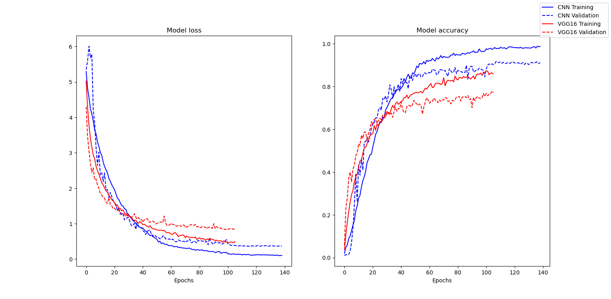

# HUST-FACE-RECOGNITION-SYSTEM-CNN
Group 23 members:

- Nguyen Nhat Minh 20225510
- Doi Sy Thang - 20225528
- Ngo Duy Dat - 20225480
- Ta Ho Thanh Dat - 20225482
- Nguyen Minh Quan - 20225520

## Projects description

A Python program that uses cv2 face detection with a pre-trained CNN model for face recognition.
The model is trained using Google Colab T4 GPU and TensorFlow libraries on a dataset comprised of
99 different labels, each has about 20 images. The model should be capable of recognizing human faces that
it is trained on and be able to put matching labels when the uncertainty is low enough.

## CNN model

Our CNN model is inspired by the VGG-16 model and tailored to be able to be trained on a much smaller
dataset. The model accepts 224x224x1 grayscale images as input and the output will be the probability
of each image being assigned to each label. The predicted label is considered to be the label
with the highest probability. More detailed concepts of our proposed model and CNN are in this report![20231_intro_ai_group_23.pdf]

The model consists of 8 Convolution layers with ReLu activation followed by batchNormalization to
perform feature extraction. The last few layers include a flattened layer, a Dense layer with ReLu
activation, and a Dense layer with Softmax activation for the output. The model also uses an Adam
optimizer with a custom learning rate and SparseCategoricalCrossentropy loss function.
Details about the model's architecture can be found in.

The dataset is split into two: data_train and data_test and the model is trained exclusively on
data_train. The model is then validated based on its accuracy on data_test and trained with
early escape.

Below is the performance of our model compared with VGG-16:
.

## Requirements

`requirements.txt`

```
cvzone==1.6.1
keras==2.14.0
matplotlib==3.8.0
numpy==1.26.0
opencv-python==4.8.1.78
tensorflow==2.14.0
pyautogui==0.9.54
```

3rd party app: [Epoccam Camera Hub by Elgato](https://www.elgato.com/us/en/s/downloads)

## Folder structures

```
.
├── Assets/
|   ├── Faces/              # Image representation of each labels
|   ├── UI/                 # UI assets
├── Models/
|   ├── JSON/               # JSON files containing the information of each model
|   ├── Trained/            # Trained models
|   ├── Weights/            # Model weights
|   ├── summary.txt         # Summary of the main model
|   ├── performance.png     # Comparison between our model and vgg16
|   └── cnn_model.py        # CNN model instance
├── Modules/
|   ├── detect_faces.py     # Face detection module
|   └── get_repr.py         # Handle showing label image
├── face_recognition.py     # Face recognition main program
├── live_recognition.py     # Real-time face recognition
├── phone_recognition.py    # Face recognition using a better camera from the phone and screen capture
└── requirement.txt         # Dependencies

```

## How to use

`face_recognition.py`

- run the Python file
- Press "f" to flip camera
- Press "c" to capture the detected face and give a prediction
- Press "s" to show captured face
- Press "q" to quit
- to swap the current model, press "," or "."

  `live_recognition.py`

- run the Python file
- Press "q" to quit
